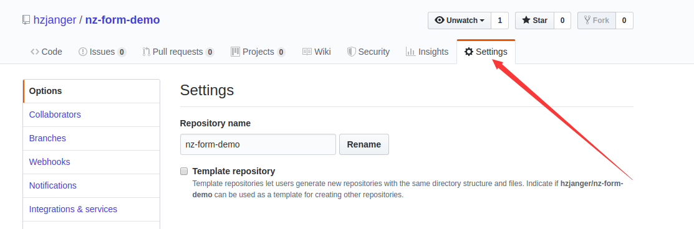
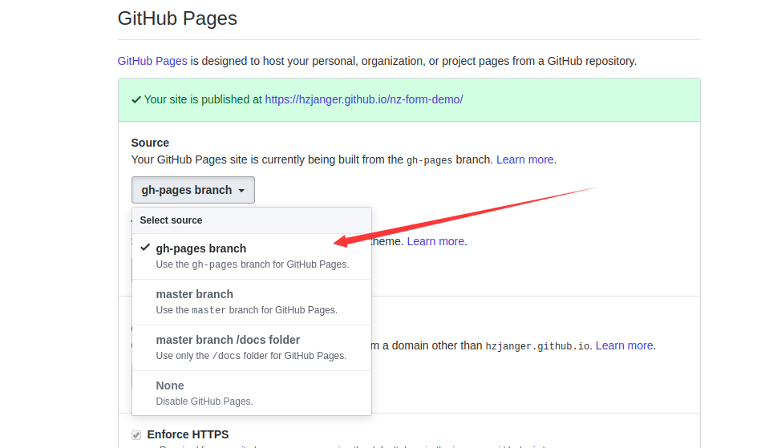

# 项目发布

## 发布到github gitPage

1. 在github上创建一个仓库`nz-form-demo`

2. 使用 Angular CLI 命令 ng build 来构建这个 GitHub 项目

```bash
ng build --prod --base-href "https://hzjanger.github.io/nz-form-demo/"
# https://hzjanger.github.io/nz-form-demo/
# hzjanger为你的github的用户名, nz-form-demo为你创建的仓库名称
```

3. 进入`dist/nz-form-demo`目录,将文件上传到`nz-form-demo`仓库的一个分支中,分支名称叫做`gh-pages`

选择settings



选择发布方式



提交的命令可以使用一个`shell`脚本来完成

```shell
#!/usr/bin/env sh

# 确保脚本抛出遇到的错误
set -e

# 生成静态文件
ng build --prod --base-href "https://hzjanger.github.io/nz-form-demo/"

# 进入生成的文件夹
cd dist/nz-form-demo

# 如果是发布到自定义域名
# echo 'www.example.com' > CNAME

git init
git add -A
git commit -m 'deploy'

# 如果发布到 https://<USERNAME>.github.io
# git push -f git@github.com:<USERNAME>/<USERNAME>.github.io.git master

# 如果发布到 https://<USERNAME>.github.io/<REPO>
git push -f git@github.com:hzjanger/nz-form-demo.git master:gh-pages

cd -
```

::: tip
这个shell脚本是在项目的跟目录下
:::