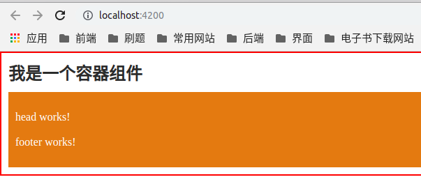
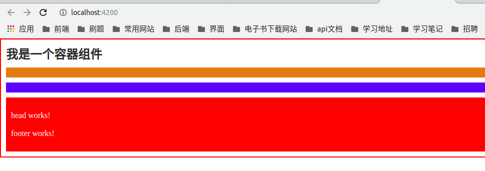
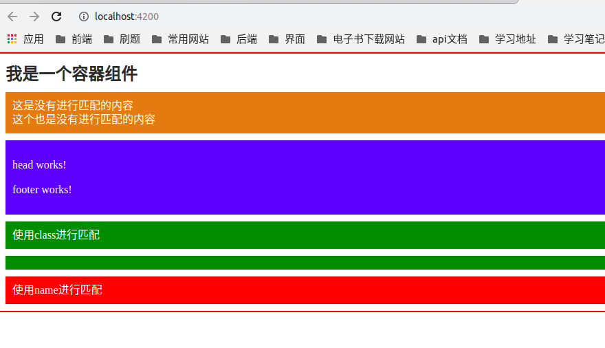
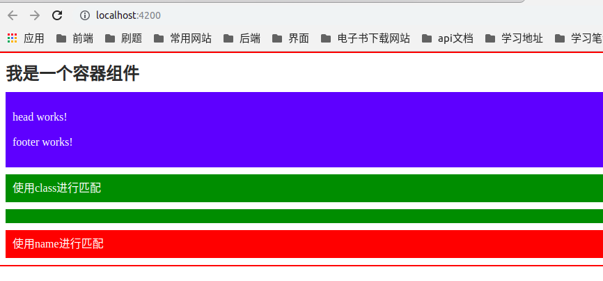

# 组件内容映射

参考文章：[https://www.cnblogs.com/laixiangran/p/8723166.html](https://www.cnblogs.com/laixiangran/p/8723166.html)

在Angular中，组件可以作为一个标签使用，作为一个标签，就可以定义`css`样式`:host`,也可以往标签里面写入内容，但是作为一个组件，使用`templateUrl`指定了组件的模板，在往里面写入内容就不知道应该添加到什么地方，使用`ng-content`、`select`属性可以解决这个问题

## 文件目录结构

```
src/
├── app
│   ├── app.component.html
│   ├── app.component.scss
│   ├── app.component.spec.ts
│   ├── app.component.ts
│   ├── app.module.ts
│   ├── app-routing.module.ts
│   ├── content
│   │   ├── content.component.html
│   │   ├── content.component.scss
│   │   ├── content.component.spec.ts
│   │   └── content.component.ts
│   ├── footer
│   │   ├── footer.component.html
│   │   ├── footer.component.scss
│   │   ├── footer.component.spec.ts
│   │   └── footer.component.ts
│   └── header
│       ├── header.component.html
│       ├── header.component.scss
│       ├── header.component.spec.ts
│       └── header.component.ts

```

## ng-content

### 1. 只有一个`ng-content`

app.component.html
```html
<app-content>
  <app-header></app-header>
  <app-footer></app-footer>
</app-content>
```

content.component.html
```html
<div class="content">
  <h2>我是一个容器组件</h2>

  <div class="out-value">
    <ng-content></ng-content>
  </div>
</div>
```

content.component.scss

```scss
.content {
  padding: 10px;
  border: 2px solid red;

  h2 {
    margin: 0;
    color: #262626;
  }

  .out-value {
    padding: 10px;
    margin-top: 10px;
    line-height: 20px;
    color: #FFFFFF;
    background-color: #de7d28;
  }
}

```

可以看到`app-header`和`app-footer`都在橙色区域



### 2. 有两个或两个以上的`ng-content`

更改`content.component.html`的内容

```html
<div class="content">
  <h2>我是一个容器组件</h2>

  <div class="out-value">
    <ng-content></ng-content>
  </div>

  <div class="out-value blue">
    <ng-content></ng-content>
  </div>

  <div class="out-value red">
    <ng-content></ng-content>
  </div>
</div>

```

更改`content.component.scss`的内容

```scss
.content {
  padding: 10px;
  border: 2px solid red;

  h2 {
    margin: 0;
    color: #262626;
  }

  .out-value {
    padding: 10px;
    margin-top: 10px;
    line-height: 20px;
    color: #FFFFFF;
    background-color: #de7d28;

    &.blue {
      background-color: blue;
    }

    &.red {
      background-color: red;
    }
  }
}

```

这里有三个`ng-content`,但是都没有指定内容，那么就会映射到最后一个`ng-content`




### 3. 使用`select`指定映射

映射规则

1. 必须是直接子节点

2. 支持css选择器

3. 未指定映射的都会到没有`select`的`ng-content`中

4. 指定了而且有相同的选择的是**第一个**不是**最后一个**

5. 如果没有指定映射并且没有单独的`ng-content`，那么不会显示

app.component.html
```html

<app-content>

  <div>这是没有进行匹配的内容</div>
  <app-header></app-header>
  <app-footer></app-footer>
  <div class="con1">使用class进行匹配</div>
  <div name="con2">使用name进行匹配</div>
  <div>这个也是没有进行匹配的内容</div>
</app-content>
```

content.component.html

```html
<div class="content">
  <h2>我是一个容器组件</h2>

  <div class="out-value">
    <ng-content></ng-content>
  </div>

  <div class="out-value blue">
    <ng-content select="app-header"></ng-content>
    <ng-content select="app-footer"></ng-content>
  </div>

  <div class="out-value green">
    <ng-content select=".con1"></ng-content>
  </div>

  <div class="out-value green">
    <ng-content select=".con1"></ng-content>
  </div>

  <div class="out-value red">
    <ng-content select="[name=con2]"></ng-content>
  </div>
</div>

```

content.component.scss


```scss
.content {
  padding: 10px;
  border: 2px solid red;

  h2 {
    margin: 0;
    color: #262626;
  }

  .out-value {
    padding: 10px;
    margin-top: 10px;
    line-height: 20px;
    color: #FFFFFF;
    background-color: #de7d28;

    &.blue {
      background-color: blue;
    }

    &.green {
      background-color: green;
    }

    &.red {
      background-color: red;
    }
  }
}

```



可以看到第二个`select=".con1"`并没有内容

如果把

```html
<div class="out-value">
    <ng-content></ng-content>
  </div>
```
去掉，那么就会变为




## ngProjectAs

这是为了解决`ng-content`的`select`必须是直接子节点这个缺点

```
<app-content>
  <div>这是没有进行匹配的内容</div>
  <div ngProjectAs="app-header">
    <app-header></app-header>
  </div>
  <app-footer></app-footer>
  <div class="con1">使用class进行匹配</div>
  <div name="con2">使用name进行匹配</div>
  <div>这个也是没有进行匹配的内容</div>
</app-content>
```

::: tip
这个不能作用在组件定义的标签上如`<app-header>`上
:::

## ng-template

`ng-content`所对应的组件只初始化一次，就好比路由的`快照`一样，而`ng-template`就和路由的`订阅`一样，组件户进行多次初始化

1. 先更改`footer.component.ts`和`header.component.ts`里面的内容，在生命周期`ngOnInit`里面打印一句话

```typescript
  ngOnInit() {
    //footer.component.ts打印的话不要相同
    console.log('header被初始化了');
  }
```

2. 更改`app.component.html`里面的内容

<app-content>
  <div>这是没有进行匹配的内容</div>
  <ng-template>
    <app-header></app-header>
  </ng-template>
  <app-footer></app-footer>
  <div class="con1">使用class进行匹配</div>
  <div name="con2">使用name进行匹配</div>
  <div>这个也是没有进行匹配的内容</div>
</app-content>

3. 在`content.component.ts`定义几个成员变量

```typescript
export class ContentComponent implements OnInit {

  // @ts-ignore
  @ContentChild(TemplateRef) template: TemplateRef;

  header: boolean = false;

  footer: boolean = false;

  constructor() { }

  ngOnInit() {
  }

}
```

4. 修改`content.component.html`的内容

```html

<button (click)="header = !header">显示header</button>
<button (click)="footer = !footer">显示footer</button>
<div class="content">
  <h2>我是一个容器组件</h2>

  <div class="out-value">
    <ng-content></ng-content>
  </div>

  <div class="out-value blue" *ngIf="header">
    <ng-container [ngTemplateOutlet]="template"></ng-container>
  </div>

  <div class="out-value blue" *ngIf="footer">
    <ng-content select="app-footer"></ng-content>
  </div>

  <div class="out-value green">
    <ng-content select=".con1"></ng-content>
  </div>

  <div class="out-value green">
    <ng-content select=".con1"></ng-content>
  </div>

  <div class="out-value red">
    <ng-content select="[name=con2]"></ng-content>
  </div>
</div>

```